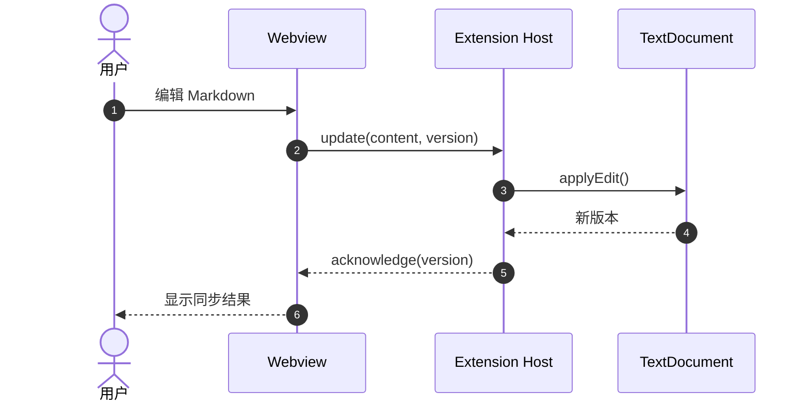
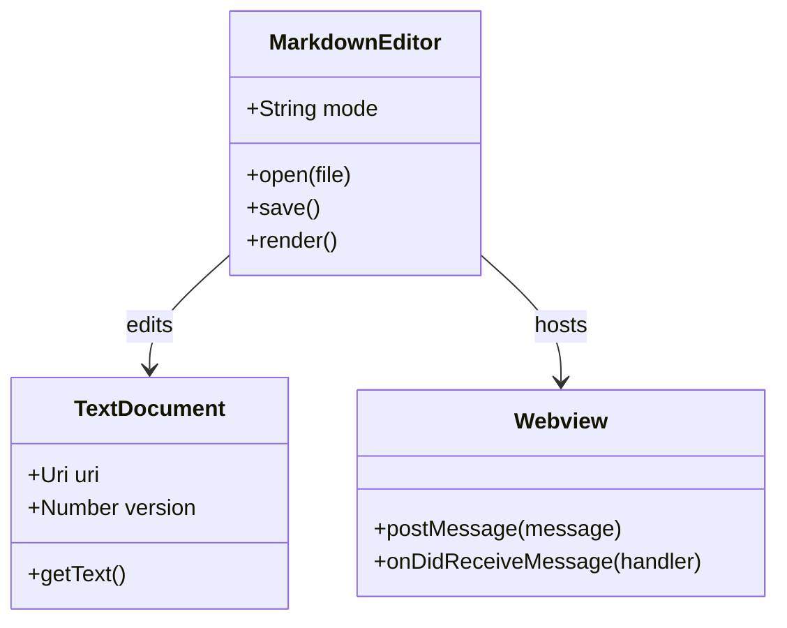
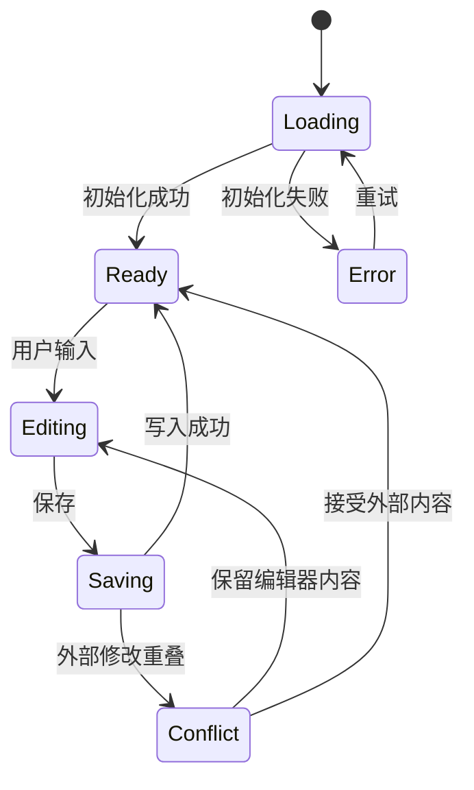
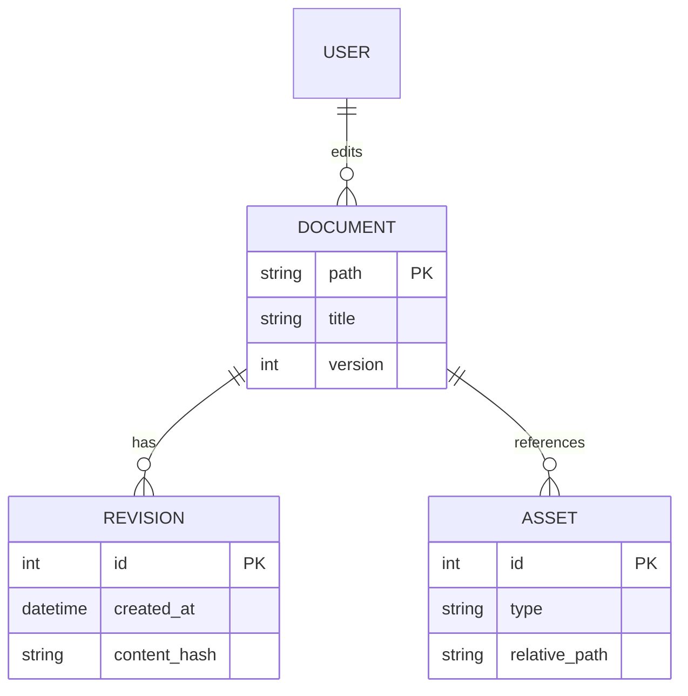
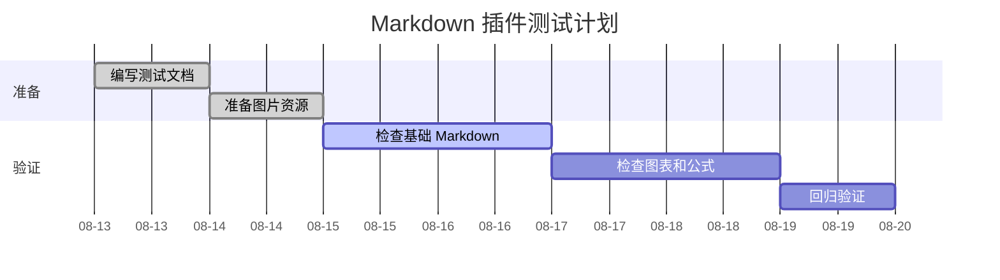
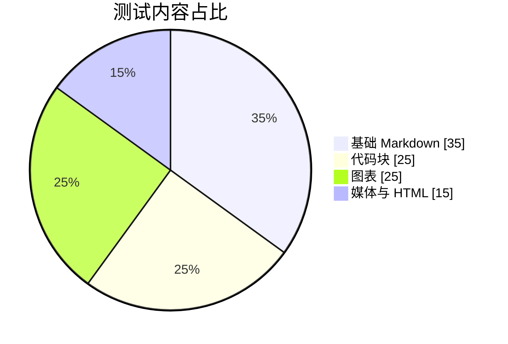
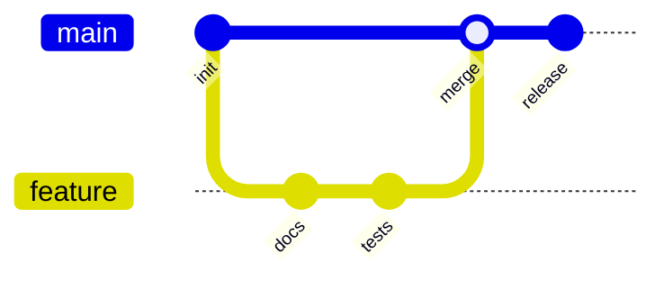
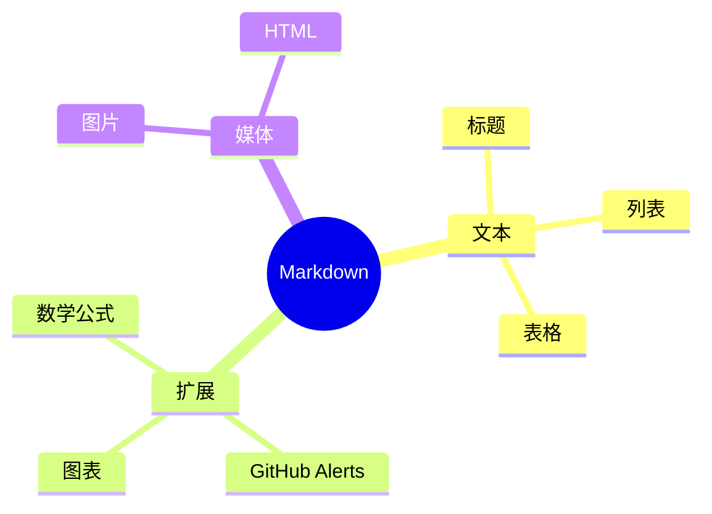
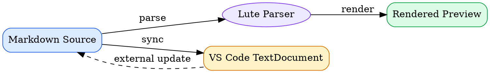
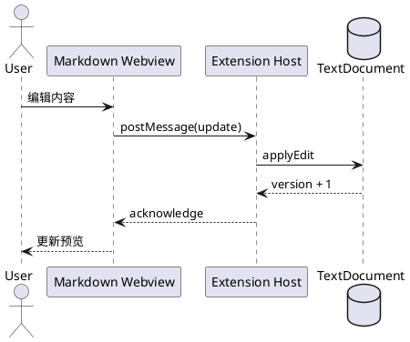

# 图表与特殊代码块渲染测试

本文件覆盖 GitHub 原生图表和当前插件通过 Vditor 3.11.2 提供的扩展图表。

| 标记 | 含义 |
| --- | --- |
| GitHub + Vditor | 两边都应富渲染 |
| Vditor 扩展 | 插件应富渲染，GitHub 只显示代码 |
| GitHub 原生 | GitHub 应富渲染，当前插件可能只显示代码 |

> [!NOTE]
> Vditor 扩展图表首次渲染时可能需要从 CDN 加载依赖。无论是否成功生成图形，都必须保留可编辑的原始代码，保存时不得写回生成的 SVG 或 HTML。

## 1. Mermaid（GitHub + Vditor）

### 1.1 流程图


### 1.2 时序图



### 1.3 类图



### 1.4 状态图



### 1.5 ER 图



### 1.6 甘特图



### 1.7 饼图



### 1.8 Git 提交图



### 1.9 Mermaid 思维导图



> 如果 Git 图或思维导图无法显示，而前面的 Mermaid 图可以显示，请记录所加载 Mermaid 版本及对应语法支持情况。

## 2. Graphviz（Vditor 扩展）



## 3. ECharts（Vditor 扩展）

### 3.1 柱状图与折线图

```echarts
{
  "title": { "text": "每类测试数量", "left": "center" },
  "tooltip": { "trigger": "axis" },
  "legend": { "data": ["通过", "总数"], "top": 30 },
  "xAxis": {
    "type": "category",
    "data": ["基础", "代码", "图表", "公式", "HTML"]
  },
  "yAxis": { "type": "value", "minInterval": 1 },
  "series": [
    {
      "name": "通过",
      "type": "bar",
      "data": [12, 27, 8, 10, 9],
      "itemStyle": { "color": "#3b82f6" }
    },
    {
      "name": "总数",
      "type": "line",
      "data": [12, 30, 9, 10, 10],
      "smooth": true
    }
  ]
}
```

### 3.2 环形图

```echarts
{
  "title": { "text": "渲染状态", "left": "center" },
  "tooltip": { "trigger": "item" },
  "series": [
    {
      "name": "状态",
      "type": "pie",
      "radius": ["40%", "70%"],
      "data": [
        { "value": 82, "name": "通过" },
        { "value": 12, "name": "待检查" },
        { "value": 6, "name": "失败" }
      ]
    }
  ]
}
```

## 4. flowchart.js（Vditor 扩展）

```flowchart
st=>start: 开始
input=>inputoutput: 输入 Markdown
parse=>operation: 解析文档
check=>condition: 是否成功？
preview=>operation: 显示预览
error=>operation: 显示错误
end=>end: 结束

st->input->parse->check
check(yes)->preview->end
check(no)->error->input
```

## 5. ECharts Mindmap（Vditor 扩展）

`mindmap` 块使用 JSON 树结构，而不是 Mermaid 的缩进语法。

```mindmap
{
  "name": "Markdown Interactor",
  "children": [
    {
      "name": "编辑模式",
      "children": [
        { "name": "WYSIWYG" },
        { "name": "Split View" }
      ]
    },
    {
      "name": "扩展语法",
      "children": [
        { "name": "图表" },
        { "name": "公式" },
        { "name": "Alerts" }
      ]
    },
    {
      "name": "资源",
      "children": [
        { "name": "本地图片" },
        { "name": "远程媒体" }
      ]
    }
  ]
}
```

## 6. Markmap（Vditor 扩展）

```markmap
# Markdown Interactor

## 编辑

- WYSIWYG
- Split View
  - 源码
  - 实时预览

## 内容

- 基础 Markdown
  - 标题
  - 列表
  - 表格
- 扩展语法
  - KaTeX
  - Mermaid
  - GitHub Alerts

## 输出

- Markdown
- HTML
```

## 7. PlantUML（Vditor 扩展）

> [!WARNING]
> Vditor 的 PlantUML 渲染会请求 `https://www.plantuml.com`。离线、网络策略限制或远程服务不可用时，该图可能无法显示。



## 8. ABC 乐谱（Vditor 扩展）

```abc
X:1
T:Markdown Render Test
M:4/4
L:1/8
Q:1/4=120
K:C
|: C2 E2 G2 c2 | c2 G2 E2 C2 | F2 A2 c2 A2 | G8 :|
```

预期：显示一小段五线谱，而不是普通文本代码块。

## 9. SMILES 分子结构（Vditor 扩展）

乙醇：

```smiles
CCO
```

苯环：

```smiles
C1=CC=CC=C1
```

预期：显示对应的二维分子结构；若依赖未加载，应显示可诊断的错误而不是导致整个编辑器失效。

## 10. GeoJSON 地图（GitHub 原生）

GitHub 会将 `geojson` 围栏渲染为可交互地图。当前插件尚无 GeoJSON 富渲染器时，应稳定显示普通代码块。

```geojson
{
  "type": "FeatureCollection",
  "features": [
    {
      "type": "Feature",
      "properties": {
        "name": "San Francisco",
        "marker-color": "#0969da"
      },
      "geometry": {
        "type": "Point",
        "coordinates": [-122.4194, 37.7749]
      }
    },
    {
      "type": "Feature",
      "properties": {
        "name": "Test route",
        "stroke": "#cf222e"
      },
      "geometry": {
        "type": "LineString",
        "coordinates": [
          [-122.4312, 37.7739],
          [-122.4194, 37.7749],
          [-122.4058, 37.7858]
        ]
      }
    }
  ]
}
```

## 11. TopoJSON 地图（GitHub 原生）

```topojson
{
  "type": "Topology",
  "transform": {
    "scale": [0.001, 0.001],
    "translate": [-122.45, 37.75]
  },
  "objects": {
    "testArea": {
      "type": "GeometryCollection",
      "geometries": [
        {
          "type": "Polygon",
          "arcs": [[0]],
          "properties": { "name": "Test area" }
        }
      ]
    }
  },
  "arcs": [
    [[0, 0], [40, 0], [0, 40], [-40, 0], [0, -40]]
  ]
}
```

预期：GitHub 显示地图区域；当前插件即使只显示 JSON 源码，也不应误调用 ECharts 或改写内容。

## 12. STL 三维模型（GitHub 原生）

```stl
solid tetrahedron
  facet normal 0 0 -1
    outer loop
      vertex 0 0 0
      vertex 1 0 0
      vertex 0 1 0
    endloop
  endfacet
  facet normal 0 -1 0
    outer loop
      vertex 0 0 0
      vertex 0.5 0.5 1
      vertex 1 0 0
    endloop
  endfacet
  facet normal 1 1 1
    outer loop
      vertex 1 0 0
      vertex 0.5 0.5 1
      vertex 0 1 0
    endloop
  endfacet
  facet normal -1 0 0
    outer loop
      vertex 0 1 0
      vertex 0.5 0.5 1
      vertex 0 0 0
    endloop
  endfacet
endsolid tetrahedron
```

预期：GitHub 显示可旋转的四面体；当前插件尚无 STL 富渲染器时显示普通代码块。

## 13. 图表连续渲染检查

完成以上测试后，请再次滚动到文档顶部并检查：

- Mermaid 图没有因后续图表加载而消失；
- ECharts 在容器宽度变化后仍可读；
- GeoJSON、TopoJSON 和 STL 即使未富渲染，也不会撑破布局或丢失源码；
- 图表之间没有共享错误的数据或主题；
- 深色主题下标签、连线和背景有足够对比度；
- 切换编辑模式后图表可以重新渲染；
- 保存文件不会把图表源码替换为生成的 SVG 或 HTML。
