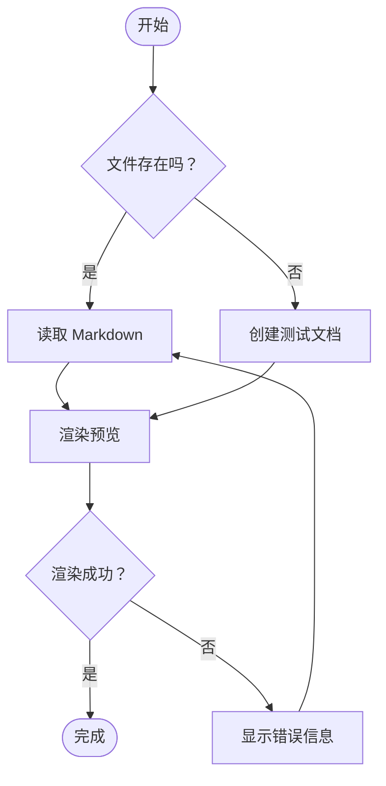
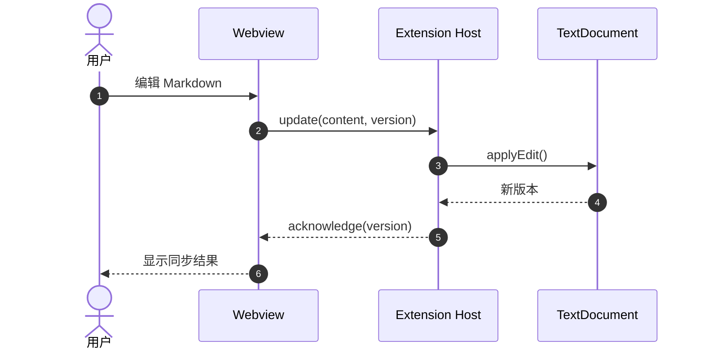
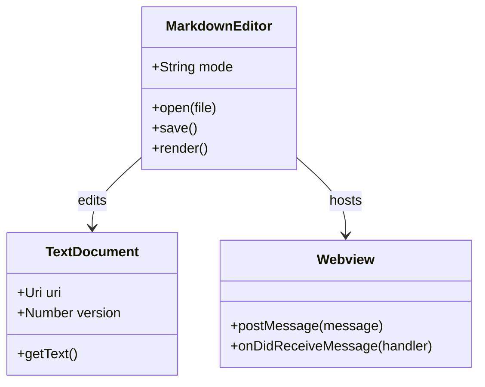
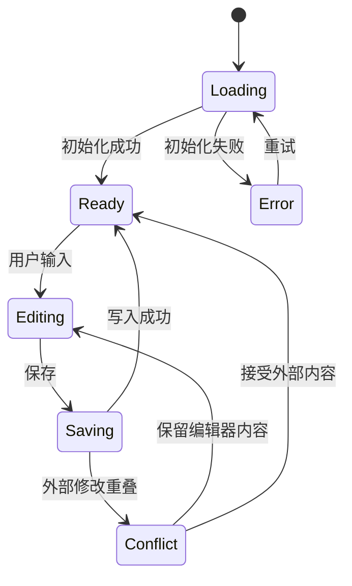
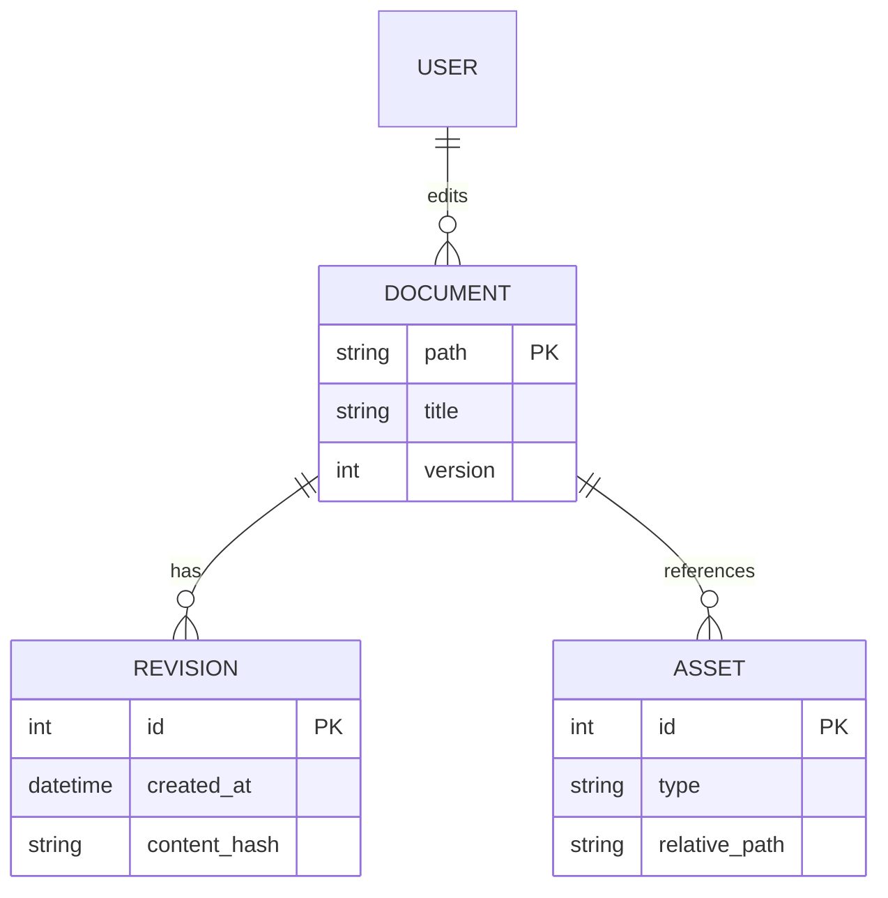
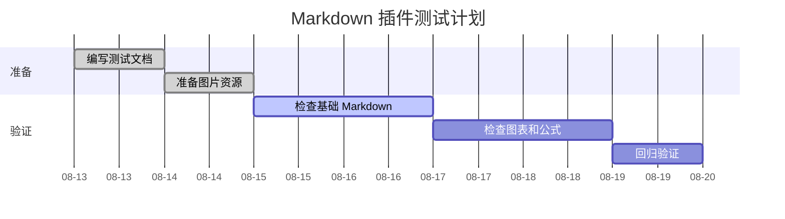
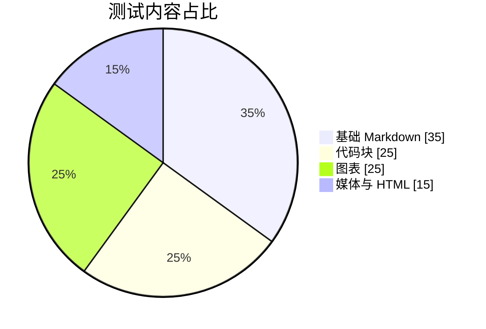
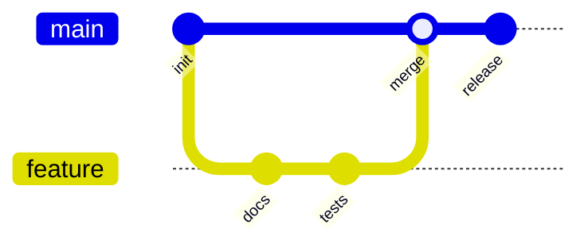
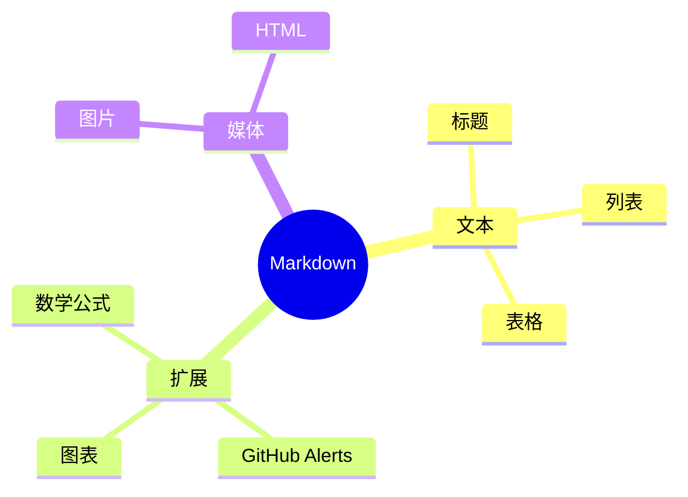
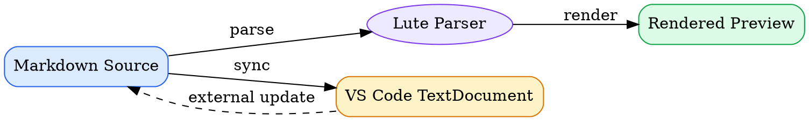

# 图表与特殊代码块渲染测试

## 1. Mermaid

### 1.1 流程图



### 1.2 时序图



### 1.3 类图



### 1.4 状态图



### 1.5 ER 图



### 1.6 甘特图




### 1.7 饼图



### 1.8 Git 提交图



### 1.9 Mermaid 思维导图



> 如果 Git 图或思维导图无法显示，而前面的 Mermaid 图可以显示，请记录所加载 Mermaid 版本及对应语法支持情况。

## 2. Graphviz（Vditor 扩展）



## 3. ECharts（Vditor 扩展）

### 3.1 柱状图与折线图

```echarts
{
  "title": { "text": "每类测试数量", "left": "center" },
  "tooltip": { "trigger": "axis" },
  "legend": { "data": ["通过", "总数"], "top": 30 },
  "xAxis": {
    "type": "category",
    "data": ["基础", "代码", "图表", "公式", "HTML"]
  },
  "yAxis": { "type": "value", "minInterval": 1 },
  "series": [
    {
      "name": "通过",
      "type": "bar",
      "data": [12, 27, 8, 10, 9],
      "itemStyle": { "color": "#3b82f6" }
    },
    {
      "name": "总数",
      "type": "line",
      "data": [12, 30, 9, 10, 10],
      "smooth": true
    }
  ]
}
```

### 3.2 环形图

```echarts
{
  "title": { "text": "渲染状态", "left": "center" },
  "tooltip": { "trigger": "item" },
  "series": [
    {
      "name": "状态",
      "type": "pie",
      "radius": ["40%", "70%"],
      "data": [
        { "value": 82, "name": "通过" },
        { "value": 12, "name": "待检查" },
        { "value": 6, "name": "失败" }
      ]
    }
  ]
}
```

## 4. flowchart.js

```flowchart
st=>start: 开始
input=>inputoutput: 输入 Markdown
parse=>operation: 解析文档
check=>condition: 是否成功？
preview=>operation: 显示预览
error=>operation: 显示错误
end=>end: 结束

st->input->parse->check
check(yes)->preview->end
check(no)->error->input
```

## 6. Markmap

```markmap
# Markdown Interactor

## 编辑

- WYSIWYG
- Split View
  - 源码
  - 实时预览

## 内容

- 基础 Markdown
  - 标题
  - 列表
  - 表格
- 扩展语法
  - KaTeX
  - Mermaid
  - GitHub Alerts

## 输出

- Markdown
- HTML
```

## 8. ABC 乐谱

```abc
X:1
T:Markdown Render Test
M:4/4
L:1/8
Q:1/4=120
K:C
|: C2 E2 G2 c2 | c2 G2 E2 C2 | F2 A2 c2 A2 | G8 :|
```

预期：显示一小段五线谱，而不是普通文本代码块。
