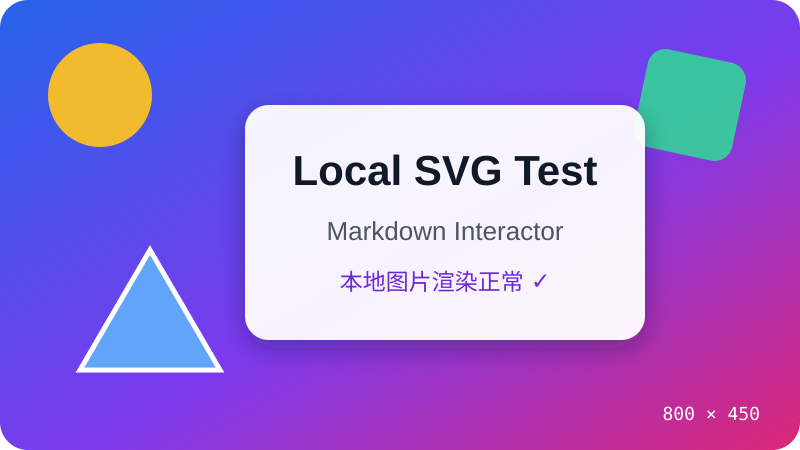

# 图片、媒体与 HTML 渲染测试

本文件只使用 GitHub Markdown 支持的图片语法和安全 HTML 子集。GitHub 与 Vditor 都会清理危险 HTML，具体允许的属性可能略有差异。

## 1. 本地 Markdown 图片



预期：显示一张带渐变背景、几何图形和“Local SVG Test”文字的图片，替代文本和标题不会直接出现在正文中。

## 3. 远程图片


预期：`markdown-interactor.allowRemoteMedia` 为 `true` 时显示徽章；设为 `false` 时远程图片被阻止，但本地图片仍可见。

## 4. 故意失效的图片


预期：编辑器不崩溃、不持续闪烁，并提供浏览器默认的失败占位或可辨识的替代文本。

## 5. HTML 图片及尺寸

<p align="center">
  
</p>

预期：图片宽度约为 360 像素，并在允许 `align` 属性时居中显示。

## 6. details / summary

<details>
<summary>点击展开 Markdown 与 HTML 混合内容</summary>

### 展开后的三级标题

这里是折叠区域中的 **粗体**、*斜体*、`代码` 和 [链接](https://example.com)。

- 折叠列表项目 A
- 折叠列表项目 B

```typescript
const insideDetails: boolean = true
console.log(insideDetails)
```

</details>

预期：点击标题可以展开和折叠；内部 Markdown 在展开后正常渲染。

## 8. HTML 块级元素

<div>
  <strong>HTML div 容器</strong>
  <p>容器中包含段落、<em>斜体</em>和 <code>inline code</code>。</p>
</div>

<p align="center"><strong>这是一段使用 GitHub 允许的 <code>align</code> 属性居中的 HTML 文本。</strong></p>

> 本测试不使用 `style`、`script`、`iframe` 或事件处理属性，因为 GitHub 会出于安全原因清理它们。

## 9. HTML 表格

<table>
  <thead>
    <tr>
      <th>功能</th>
      <th>预期结果</th>
    </tr>
  </thead>
  <tbody>
    <tr>
      <td>HTML 表头</td>
      <td>有清晰的表头样式</td>
    </tr>
    <tr>
      <td><code>code</code></td>
      <td><strong>行内标签正常</strong></td>
    </tr>
  </tbody>
</table>

## 10. HTML 注释

<!-- 这是一条 HTML 注释，预览中不应该显示。 -->

上方注释不可见，这句话应正常显示。

## 11. Markdown 与 HTML 相邻

**HTML 块之前的 Markdown。**

<div>
  <h3>HTML div 内标题</h3>
  <p>这是 div 内的 HTML 段落。</p>
</div>

*HTML 块之后的 Markdown。*
